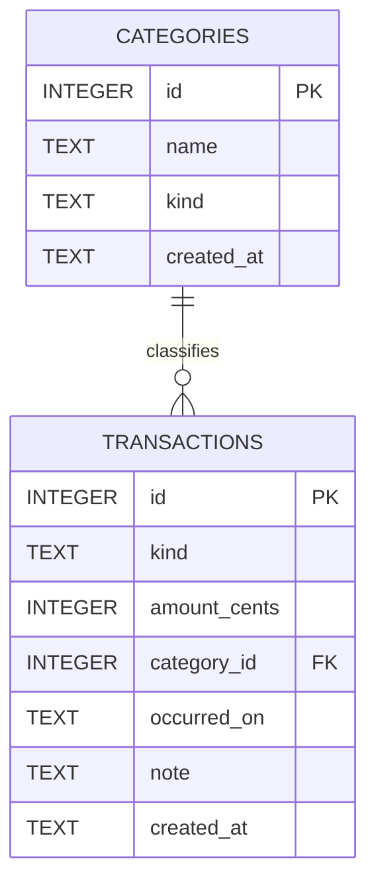
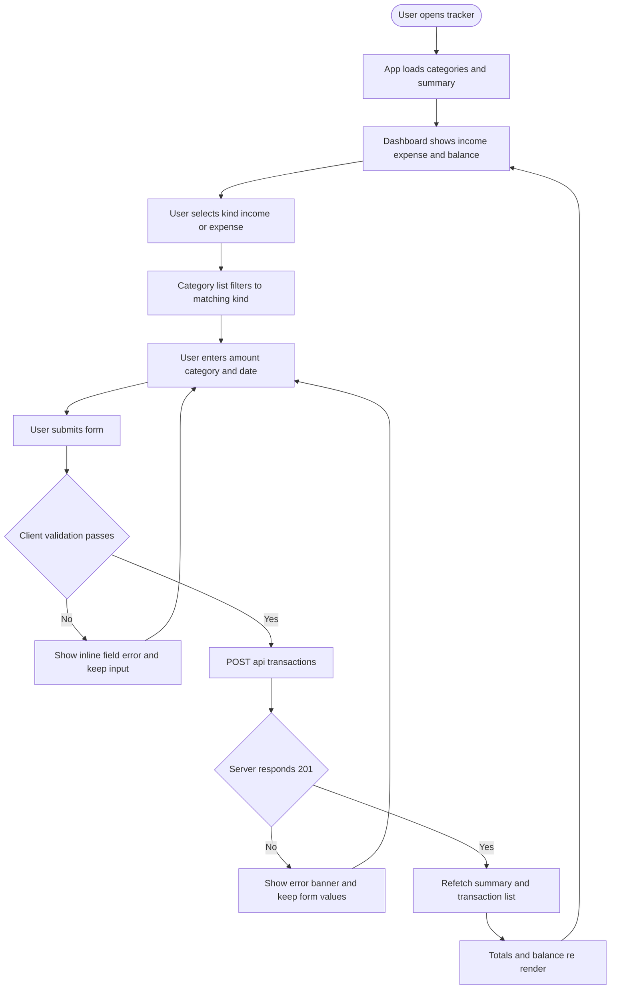
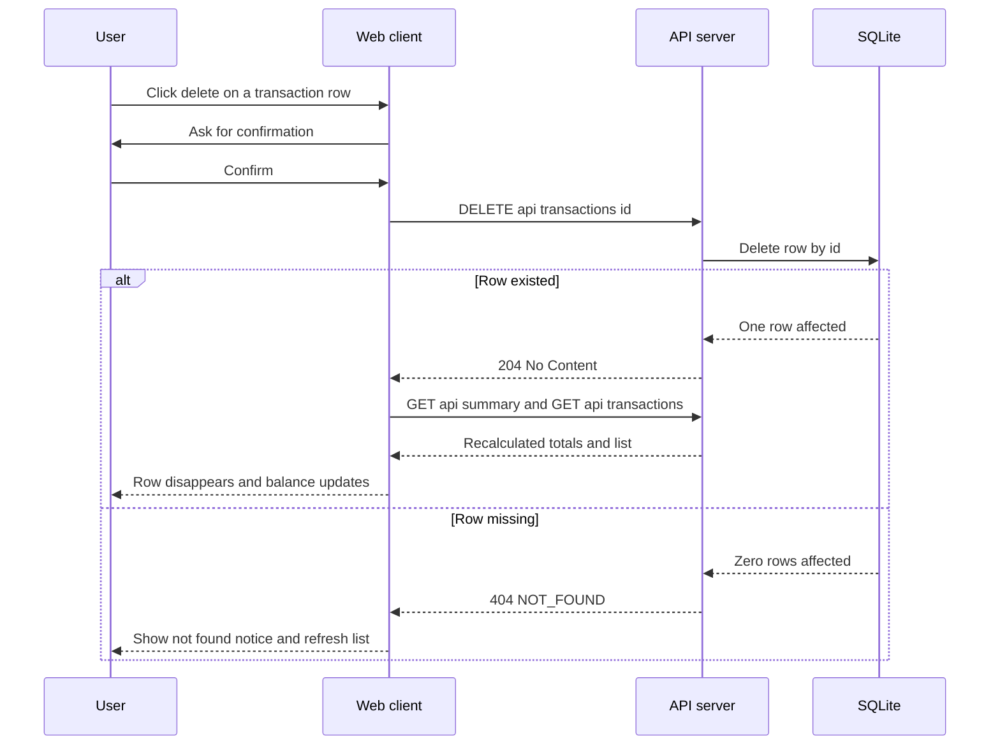
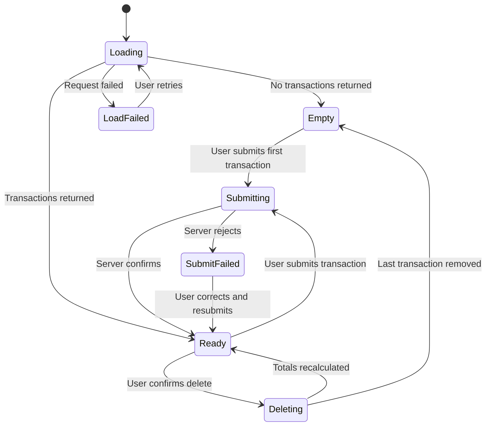

# Product Requirements Document — Income & Expense Tracker (MVP)

Derived from `docs/product-brief.md`. This document is the development contract
for the MVP: it specifies the data model, the API, every user flow, the error
states the engineering team must handle, and developer-testable acceptance
criteria.

Scope covers backlog stories **US-1 … US-7**. Stories US-8 onward are out of scope.

---

## 1. Definitions and invariants

| Term | Definition |
| --- | --- |
| `kind` | The polarity of money movement. Enum: `income`, `expense`. |
| Transaction | A single recorded money movement, immutable once created. |
| Category | A named bucket belonging to exactly one `kind`. |
| Balance | `total income − total expense`, in cents. |

**System invariants** — must hold at all times:

- **INV-1** — Monetary values are persisted as **integer cents**. No floating
  point value is ever written to the database.
- **INV-2** — `transaction.amount_cents > 0`. Polarity is carried by `kind`,
  never by the sign of the amount.
- **INV-3** — `transaction.kind == category.kind` for the referenced category.
  An expense may not be filed under an income category.
- **INV-4** — `balance_cents == total_income_cents − total_expense_cents` for
  any given filter window.
- **INV-5** — A category referenced by at least one transaction cannot be
  deleted (deletion is out of MVP scope; the constraint is enforced at schema
  level so it holds when deletion arrives).

---

## 2. Data model

### 2.1 Entity relationship diagram



### 2.2 `categories`

| Column | Type | Constraints | Notes |
| --- | --- | --- | --- |
| `id` | INTEGER | PK, autoincrement | |
| `name` | TEXT | NOT NULL, length 1–40 after trim | Stored trimmed |
| `kind` | TEXT | NOT NULL, CHECK in (`income`,`expense`) | |
| `created_at` | TEXT | NOT NULL, ISO-8601 UTC | Server-assigned |

Unique constraint on (`name`, `kind`), case-insensitive. The same name may exist
once as income and once as expense (e.g. "Refund").

**Seed data**, inserted on first run only:

- Income: `Salary`, `Freelance`, `Interest`, `Other Income`
- Expense: `Rent`, `Food`, `Transport`, `Utilities`, `Shopping`, `Health`, `Other Expense`

### 2.3 `transactions`

| Column | Type | Constraints | Notes |
| --- | --- | --- | --- |
| `id` | INTEGER | PK, autoincrement | |
| `kind` | TEXT | NOT NULL, CHECK in (`income`,`expense`) | Denormalised from category for query speed; INV-3 enforced in the service layer |
| `amount_cents` | INTEGER | NOT NULL, CHECK > 0 | INV-1, INV-2 |
| `category_id` | INTEGER | NOT NULL, FK → `categories.id` ON DELETE RESTRICT | |
| `occurred_on` | TEXT | NOT NULL, `YYYY-MM-DD` | The date the money moved |
| `note` | TEXT | NULL, max 140 chars | Optional free text |
| `created_at` | TEXT | NOT NULL, ISO-8601 UTC | Server-assigned |

Indexes: `(occurred_on DESC)`, `(kind)`, `(category_id)`.

Foreign keys must be enabled explicitly per connection (`PRAGMA foreign_keys = ON`).

---

## 3. API specification

Base path `/api`. All requests and responses are `application/json`.
All monetary fields on the wire are **integer cents**.

### 3.1 Endpoints

| Method | Path | Purpose | Story |
| --- | --- | --- | --- |
| GET | `/api/health` | Liveness probe | — |
| GET | `/api/categories?kind=` | List categories, optionally filtered by kind | US-1, US-2 |
| POST | `/api/categories` | Create a category | US-7 |
| GET | `/api/transactions?kind=&categoryId=&from=&to=` | List transactions, newest first | US-4 |
| POST | `/api/transactions` | Record an income or expense | US-1, US-2 |
| DELETE | `/api/transactions/:id` | Remove a transaction | US-5 |
| GET | `/api/summary?from=&to=` | Totals, balance and per-category breakdown | US-3, US-6 |

### 3.2 Request / response shapes

**POST `/api/transactions`**

```jsonc
// request
{
  "kind": "expense",          // required, "income" | "expense"
  "amountCents": 125000,      // required, integer > 0
  "categoryId": 5,            // required, must exist and match kind
  "occurredOn": "2026-09-22", // required, YYYY-MM-DD, not in the future
  "note": "Weekly groceries"  // optional, <= 140 chars
}

// 201 response
{
  "id": 17,
  "kind": "expense",
  "amountCents": 125000,
  "categoryId": 5,
  "categoryName": "Food",
  "occurredOn": "2026-09-22",
  "note": "Weekly groceries",
  "createdAt": "2026-09-22T05:31:00.000Z"
}
```

**GET `/api/summary`**

```jsonc
{
  "totalIncomeCents": 450000,
  "totalExpenseCents": 187500,
  "balanceCents": 262500,
  "byCategory": [
    { "categoryId": 5, "categoryName": "Food", "kind": "expense", "totalCents": 125000, "transactionCount": 3 }
  ]
}
```

`byCategory` is sorted by `totalCents` descending and omits categories with no
transactions in the window.

### 3.3 Error envelope

Every non-2xx response uses a single shape:

```jsonc
{ "error": { "code": "VALIDATION_ERROR", "message": "amountCents must be a positive integer", "field": "amountCents" } }
```

| Code | HTTP | Raised when |
| --- | --- | --- |
| `VALIDATION_ERROR` | 400 | Any field fails the rules in §3.2 |
| `CATEGORY_KIND_MISMATCH` | 400 | INV-3 violated |
| `NOT_FOUND` | 404 | Unknown transaction or category id |
| `DUPLICATE_CATEGORY` | 409 | Category name already exists for that kind |
| `INTERNAL_ERROR` | 500 | Unhandled failure; details logged, not returned |

---

## 4. User flows

### 4.1 Record a transaction (US-1, US-2)



### 4.2 Delete a transaction (US-5)



### 4.3 System states



---

## 5. Edge cases and error states

The engineering team must explicitly handle each of the following.

### 5.1 Input and validation

| ID | Case | Required behaviour |
| --- | --- | --- |
| EC-1 | Amount is `0`, negative, or blank | 400 `VALIDATION_ERROR`; nothing persisted |
| EC-2 | Amount has more than 2 decimal places (e.g. `10.999`) | Rejected at the client before conversion to cents |
| EC-3 | Amount exceeds `Number.MAX_SAFE_INTEGER` cents | 400 `VALIDATION_ERROR`; no silent precision loss |
| EC-4 | Amount submitted as a string (`"100"`) | Coerced and validated, or rejected — never `NaN` into the database |
| EC-5 | Floating point input `0.1 + 0.2` | Converted via rounded cents, so `10.1 + 10.2` totals exactly `20.30` |
| EC-6 | `occurredOn` malformed or non-existent (`2026-02-30`) | 400 `VALIDATION_ERROR` |
| EC-7 | `occurredOn` in the future | 400 `VALIDATION_ERROR` — the ledger records what happened |
| EC-8 | `note` longer than 140 chars | 400 `VALIDATION_ERROR` |
| EC-9 | Category name differing only by case or whitespace | Treated as duplicate; 409 `DUPLICATE_CATEGORY` |
| EC-10 | Unknown `categoryId` | 404 `NOT_FOUND` |
| EC-11 | Expense filed under an income category | 400 `CATEGORY_KIND_MISMATCH` |

### 5.2 System and integrity

| ID | Case | Required behaviour |
| --- | --- | --- |
| EC-12 | Empty ledger | Summary returns zeros, not `null`; UI shows an empty state, not a broken layout |
| EC-13 | Delete of an already-deleted id | 404 `NOT_FOUND`; UI refreshes rather than desyncing |
| EC-14 | Double submit from a double click | Submit button disabled while the request is in flight |
| EC-15 | API unreachable / connection drop | Error banner with retry; entered form values are preserved |
| EC-16 | Database file missing or unwritable | Startup fails loudly with a clear message; the server does not serve a silently empty ledger |
| EC-17 | Concurrent writes from two browser tabs | SQLite write serialisation; the summary is always recomputed from rows, never cached client-side |
| EC-18 | Category deletion while transactions reference it | Blocked by `ON DELETE RESTRICT` |

---

## 6. Acceptance criteria

Gherkin-style, developer-testable. Each maps to a backlog story.

### US-1 — Record an expense

```gherkin
Feature: Record an expense

  Scenario: Successfully recording an expense
    Given the category "Food" exists with kind "expense"
    And the ledger has no transactions
    When I submit an expense of 1250.00 against "Food" dated today
    Then the response status is 201
    And the stored amount_cents is 125000
    And the total expense is 1250.00
    And the balance is -1250.00

  Scenario: Rejecting a non-positive amount
    Given the category "Food" exists with kind "expense"
    When I submit an expense of 0 against "Food"
    Then the response status is 400
    And the error code is "VALIDATION_ERROR"
    And no transaction is persisted

  Scenario: Rejecting a future date
    Given the category "Food" exists with kind "expense"
    When I submit an expense dated one day in the future
    Then the response status is 400
    And the error code is "VALIDATION_ERROR"

  Scenario: Rejecting a kind and category mismatch
    Given the category "Salary" exists with kind "income"
    When I submit an expense against "Salary"
    Then the response status is 400
    And the error code is "CATEGORY_KIND_MISMATCH"
```

### US-2 — Record an income

```gherkin
Feature: Record an income

  Scenario: Successfully recording an income
    Given the category "Salary" exists with kind "income"
    When I submit an income of 4500.00 against "Salary" dated today
    Then the response status is 201
    And the total income is 4500.00
    And the balance is 4500.00

  Scenario: Amounts do not lose precision
    Given the category "Salary" exists with kind "income"
    When I record incomes of 10.10 and 10.20
    Then the total income is exactly 20.30
```

### US-3 — See my current totals

```gherkin
Feature: View current totals

  Scenario: Totals across both kinds
    Given I have recorded income of 4500.00
    And I have recorded expenses of 1250.00 and 300.00
    When I request the summary
    Then the total income is 4500.00
    And the total expense is 1550.00
    And the balance is 2950.00

  Scenario: Empty ledger
    Given the ledger has no transactions
    When I request the summary
    Then the total income is 0.00
    And the total expense is 0.00
    And the balance is 0.00

  Scenario: Totals update without a page refresh
    Given the dashboard is open showing a balance of 0.00
    When I record an income of 100.00
    Then the displayed balance becomes 100.00 without reloading the page
```

### US-4 — Review my transactions

```gherkin
Feature: Review recorded transactions

  Scenario: Newest first ordering
    Given I recorded a transaction dated "2026-09-01"
    And I recorded a transaction dated "2026-09-20"
    When I request the transaction list
    Then the first entry is the one dated "2026-09-20"

  Scenario: Each entry shows its category
    Given I recorded an expense against "Food"
    When I request the transaction list
    Then the entry includes the category name "Food"
```

### US-5 — Delete a transaction

```gherkin
Feature: Delete a transaction

  Scenario: Deleting restores the balance
    Given I have recorded an expense of 500.00
    And the balance is -500.00
    When I delete that transaction
    Then the response status is 204
    And the balance is 0.00
    And the transaction no longer appears in the list

  Scenario: Deleting an unknown transaction
    When I delete transaction id 999999
    Then the response status is 404
    And the error code is "NOT_FOUND"
```

### US-6 — Break spending down by category

```gherkin
Feature: Category breakdown

  Scenario: Grouping and ordering
    Given I recorded expenses of 1000.00 and 200.00 against "Food"
    And I recorded an expense of 800.00 against "Rent"
    When I request the summary
    Then "Food" reports a total of 1200.00 across 2 transactions
    And "Rent" reports a total of 800.00 across 1 transaction
    And "Food" is listed before "Rent"

  Scenario: Unused categories are omitted
    Given the category "Health" exists with no transactions
    When I request the summary
    Then "Health" does not appear in the breakdown
```

### US-7 — Add a category

```gherkin
Feature: Add a category

  Scenario: Creating a new expense category
    Given no expense category named "Pets" exists
    When I create an expense category named "Pets"
    Then the response status is 201
    And "Pets" is returned when listing expense categories
    And "Pets" is not returned when listing income categories

  Scenario: Rejecting a duplicate, ignoring case and padding
    Given an expense category named "Food" exists
    When I create an expense category named "  food  "
    Then the response status is 409
    And the error code is "DUPLICATE_CATEGORY"

  Scenario: The same name may exist under each kind
    Given an expense category named "Refund" exists
    When I create an income category named "Refund"
    Then the response status is 201
```

---

## 7. Non-functional requirements

- **NFR-1** — A summary request returns in under 100 ms for a ledger of 10,000
  transactions (single-user scale; SQLite with the indexes in §2.3).
- **NFR-2** — The API is the sole owner of totals. The client never computes the
  balance itself, so INV-4 cannot drift.
- **NFR-3** — The server starts with no external service dependency: SQLite is
  embedded and the schema self-migrates and self-seeds on boot.
- **NFR-4** — All amounts are rendered to exactly two decimal places in the UI.

## 8. Traceability

| Story | Endpoints | Primary edge cases |
| --- | --- | --- |
| US-1 | POST `/api/transactions` | EC-1 … EC-8, EC-10, EC-11, EC-14 |
| US-2 | POST `/api/transactions` | EC-1, EC-5, EC-11 |
| US-3 | GET `/api/summary` | EC-12, EC-15, EC-17 |
| US-4 | GET `/api/transactions` | EC-12, EC-15 |
| US-5 | DELETE `/api/transactions/:id` | EC-13 |
| US-6 | GET `/api/summary` | EC-12 |
| US-7 | POST `/api/categories`, GET `/api/categories` | EC-9, EC-18 |
